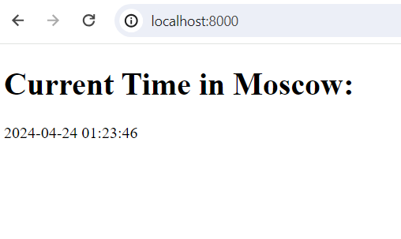
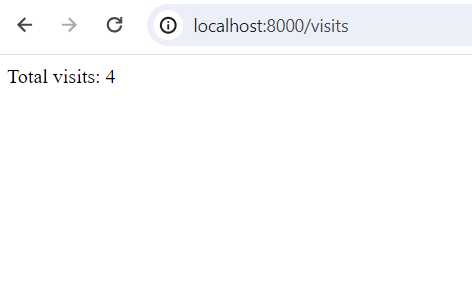

# Moscow Time Web Application

## Overview
This project is a Python web application that utilizes the Flask framework to display the current time in Moscow. The application serves as a simple example of a web-based service that retrieves and presents real-time information in a user-friendly manner.

## Features
- **Moscow Time Display:** The main functionality of the application is to showcase the current time in Moscow, providing users with an accurate and up-to-date representation.

- **Total Visits Counter:** The application also keeps track of the total number of visits to the website, displaying the count on the main page.

## Frameworks and Technologies
- **Flask Framework:** Flask was chosen for its lightweight and modular design, allowing for a quick and customizable development experience.
- **HTML and Jinja2 Templating:** The application's front-end utilizes HTML for structure and Jinja2 templating for dynamically displaying the Moscow time.

## Installation

```bash
# Clone the repository
git https://github.com/MostafaKhaled2017/S24-core-course-labs

# Navigate to the project folder
cd S24-core-course-labs

# Create a virtual environment
python -m venv venv

# Activate the virtual environment
# On Windows
venv\Scripts\activate
# On macOS/Linux
source venv/bin/activate

# Install dependencies
pip install -r app_python/requirements.txt

# Run the application
python app_python/app.py
```
## Docker Containerization

### Building the Docker Image

To build the Docker image locally, execute the following command in the root directory of the project:

```bash
docker build -t your_username/app_python .
```

Replace `your_username` with your Docker Hub username. This command will create a Docker image with the tag latest.

### Pulling the Docker Image

To pull the image from docker hub, you can use the following command:

```bash
docker pull your_username/app_python:latest
```

### Running the Docker Image
To run the Docker container and start the application, use the following command:

```bash
docker run -p 5000:5000 your_username/app_python:latest
```

<n><n>
Please note that you must have docker installed on your device to be able to run the previous commands.

### Unit Testing

The project incorporates comprehensive unit tests written using the `unittest` module in Python. The `test_app.py` file contains a specific test function, `test_get_moscow_time`, tailored for the `get_moscow_time` function in the application. 

To execute the unit test, run the following command in the terminal:

```bash
python -m unittest test_app.py
```

## Continuous Integration (CI)

This project includes a GitHub Actions CI workflow that runs on every push. The workflow performs the following steps:

- **Dependencies:** Installs project dependencies using Python `pip`.
- **Linting:** Uses Flake8 for code linting to maintain code quality.
- **Tests:** Runs Python unit tests to ensure code correctness.
- **Vulnerabilities:** Scans the project for vulnerabilities using Snyk.
- **Docker:** Builds and pushes a Docker image to Docker Hub.

The CI workflow guarantees that the project builds successfully, passes linting, and all tests before deploying.

## Screenshots


