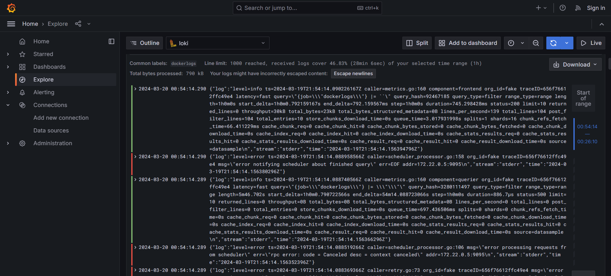
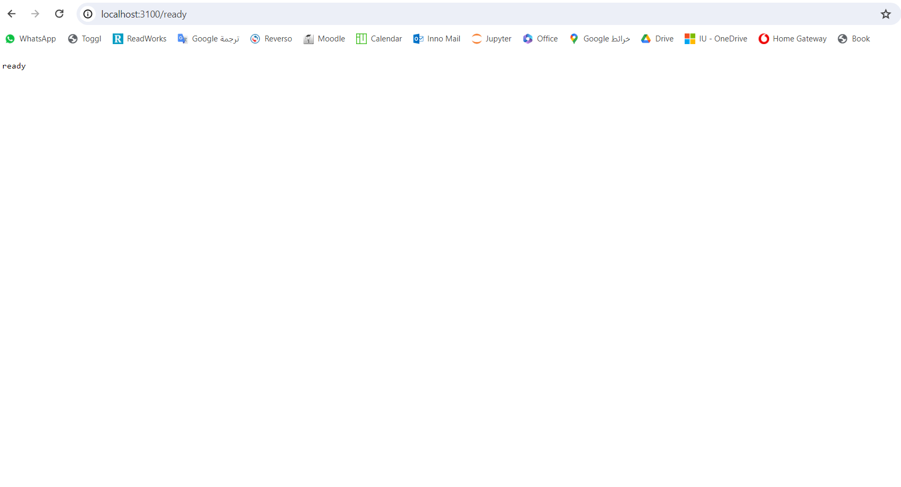

# Logging Report
In this report, we will be discussing the logging system of the application. We will be discussing the following components:
- Grafana
- Loki
- Promtail

## Grafana
Grafana is an open-source platform for monitoring and observability. It provides a powerful and elegant way to create, explore, and share dashboards and data with your team and the world.

## Loki
Loki is a horizontally-scalable, highly-available, multi-tenant log aggregation system inspired by Prometheus. It is designed to be very cost-effective and easy to operate. It does not index the contents of the logs, but rather a set of labels for each log stream.

## Promtail
Promtail is an agent which ships the contents of local logs to a private Loki instance or Grafana Cloud. It is usually deployed to every machine that has applications needed to be monitored.

## Application Logging
The application logs are stored in the Loki database. The logs are then visualized using Grafana. The logs are collected using Promtail and are then sent to Loki. The logs are then visualized using Grafana.

## Bonus Task
We have implemented the logging system in both the python application and the javascript application. We also modified the logging stacks configurationsto collect the logs from all containers defined in the docker-compose file. 

## Screenshots

